=================
Plot Examples
=================

Simple test
------------

Ensure your device works with this simple test.

.. literalinclude:: ../examples/plot_simpletest.py
    :caption: examples/plot_simpletest.py
    :lines: 5-

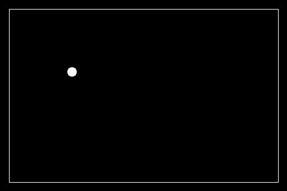

Plot Example
-------------

Plot some data for x and y

.. literalinclude:: ../examples/plot_example.py
    :caption: examples/plot_example.py
    :lines: 5-

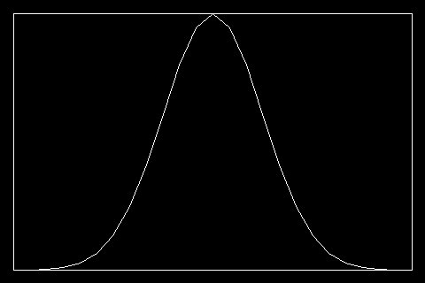

Tick Parameters Settings Example
----------------------------------

Setting up the ticks parameters

.. literalinclude:: ../examples/tickparameters.py
    :caption: examples/tickparameters.py
    :lines: 5-

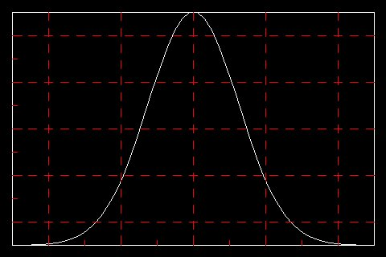

Integration Example
-------------------

Example showing different graphics elements integration

.. literalinclude:: ../examples/integration_example.py
    :caption: examples/integration_example.py
    :lines: 5-
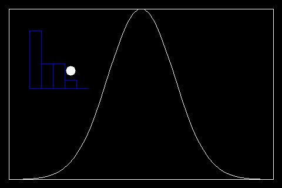

==================
Scatter examples
==================

Scatter Example
-------------------

Scatter plot Example

.. literalinclude:: ../examples/scatter.py
    :caption: examples/scatter.py
    :lines: 5-
.. image:: ../docs/scatter.jpg

Scatter Circle Pointers with diferent Radius
---------------------------------------------

Example showing how to use different radius in the circle pointers

.. literalinclude:: ../examples/scatter_circle_radius.py
    :caption: examples/scatter_circle_radius.py
    :lines: 5-
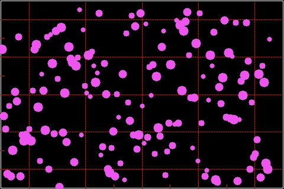

Scatter Pointers Example
----------------------------

Example showing how to use different pointers

.. literalinclude:: ../examples/scatter.py
    :caption: examples/scatter.py
    :lines: 5-
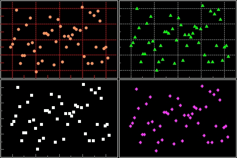

Scatter using different datasets
----------------------------------

Example showing how to use different datasets

.. literalinclude:: ../examples/scatter.py
    :caption: examples/scatter.py
    :lines: 5-
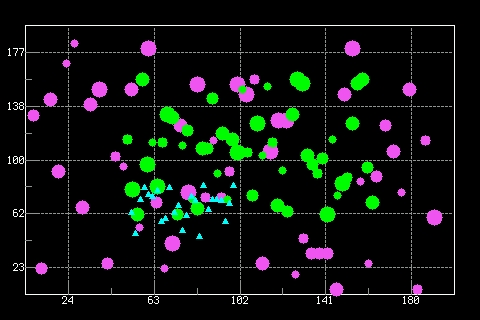

==================
Cartesian examples
==================

Cartesian and Scatter Example
------------------------------

Example showing how to use cartesian and scatter in the same plot

.. literalinclude:: ../examples/cartersian_and_scatter_polyfit_example.py
    :caption: examples/cartersian_and_scatter_polyfit_example.py
    :lines: 5-
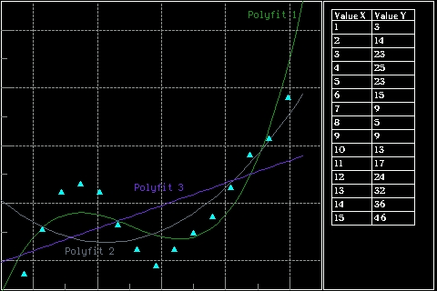

Plot Line Style Example
---------------------------

Plot some data for x and y with different line styles

.. literalinclude:: ../examples/plot_line_styles.py
    :caption: examples/plot_line_styles.py
    :lines: 5-
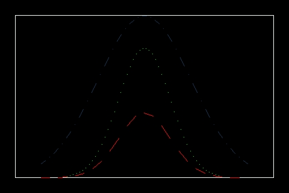

Cartesian fill Example
---------------------------

Cartesian fill example

.. literalinclude:: ../examples/cartesian_fill.py
    :caption: examples/cartesian_fill.py
    :lines: 5-
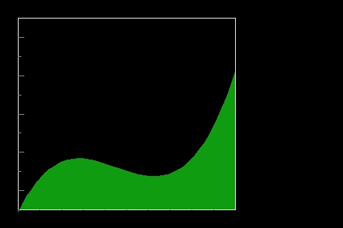

Cartesian Advanced Example
---------------------------

Showing the ability to display to graphs in the same plot with different colors

.. literalinclude:: ../examples/cartesian_advanced.py
    :caption: examples/cartesian_advanced.py
    :lines: 5-
.. image:: ../docs/cartesian_advance.jpg

Cartesian Table Example
---------------------------

Example showing how to add a data table to the plot

.. literalinclude:: ../examples/cartesian_table.py
    :caption: examples/cartesian_table.py
    :lines: 5-

Lissajous Curves Example
---------------------------

Example showing how to draw lissajous curves

.. literalinclude:: ../examples/lissajous_curves.py
    :caption: examples/lissajous_curves.py
    :lines: 5-
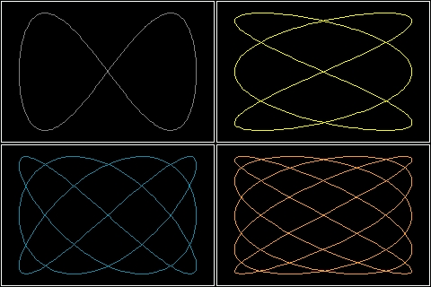

Cartesian Polar Plots Example
--------------------------------

Example showing how to draw polar plots using Cartesian

.. literalinclude:: ../examples/polar_plots.py
    :caption: examples/polar_plots.py
    :lines: 5-
.. image:: ../docs/polar_plots.jpg

Cartesian Trigonometric Plots Example
--------------------------------------

Example showing how to draw Trigonometrics plots using Cartesian

.. literalinclude:: ../examples/cartesian_trig_functions.py
    :caption: examples/cartesian_trig_functions.py
    :lines: 5-
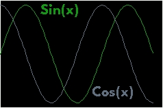

Cartesian Animation Example
---------------------------

Cartesian animation example

.. literalinclude:: ../examples/cartesian_logging_data.py
    :caption: examples/cartesian_logging_data.py
    :lines: 5-
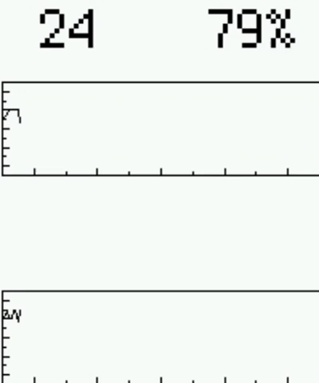

Cartesian Koch Snowflake
---------------------------

Cartesian koch snowflake example

.. literalinclude:: ../examples/cartesian_koch.py
    :caption: examples/cartesian_koch.py
    :lines: 5-
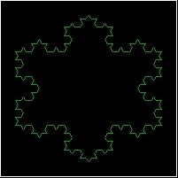

Cartesian Koch Curve
---------------------------

Cartesian koch curve example

.. literalinclude:: ../examples/cartesian_koch_2.py
    :caption: examples/cartesian_koch_2.py
    :lines: 5-
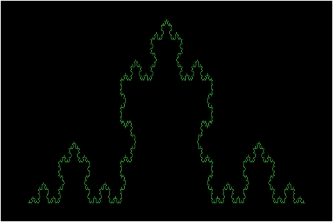

==================
Bar Examples
==================

Bar Example
----------------

Bar example

.. literalinclude:: ../examples/bar_example.py
    :caption: examples/bar_example.py
    :lines: 5-
.. image:: ../docs/bar_example.jpg

Bar Scale Example
---------------------

Bar plot example showing how to use the scale

.. literalinclude:: ../examples/bar_scale_example.py
    :caption: examples/bar_scale_example.py
    :lines: 5-
.. image:: ../docs/bar_scale.jpg

Bar Color Palette Example
----------------------------

Bar plot example showing how to pass a user color Palette

.. literalinclude:: ../examples/bar_colorpalette.py
    :caption: examples/bar_colorpalette.py
    :lines: 5-
.. image:: ../docs/bar_palette.jpg

Bar plot updating values Example
---------------------------------

Bar Plot example showing how to update values for a filled bars bar plot

.. literalinclude:: ../examples/bar_updating_values.py
    :caption: examples/bar_updating_values.py
    :lines: 5-

Bar plot updating bar colors Example
-------------------------------------

Bar Plot example showing how to update colors for a filled bars bar plot

.. literalinclude:: ../examples/bar_color_changing.py
    :caption: examples/bar_color_changing.py
    :lines: 5-

Bar 3D Example
----------------

Bar 3D example

.. literalinclude:: ../examples/bar_3Dbars.py
    :caption: examples/bar_3Dbars.py
    :lines: 5-
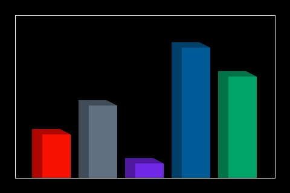

================
Pie Examples
================

Pie Example
----------------

Pie example

.. literalinclude:: ../examples/pie_example.py
    :caption: examples/pie_example.py
    :lines: 5-
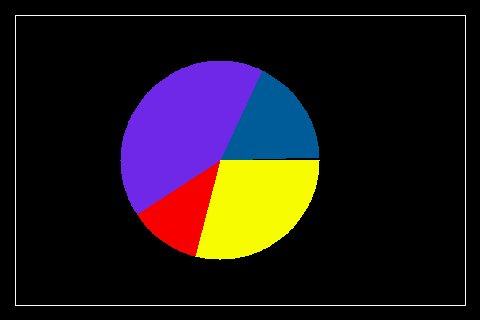

===================
Stackplot Examples
===================

Stackplot Example
---------------------------

Stackplot simple example

.. literalinclude:: ../examples/stackplot.py
    :caption: examples/stackplot.py
    :lines: 8-
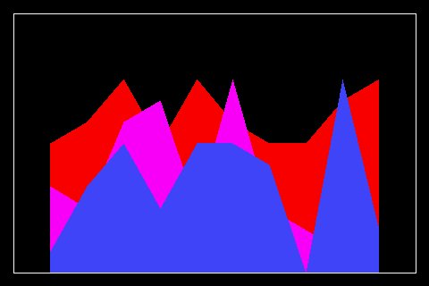

====================
Fillbetween Examples
====================

Fillbetween Example
---------------------------

Example of fillbetween plot

.. literalinclude:: ../examples/fillbetween.py
    :caption: examples/fillbetween.py
    :lines: 5-
.. image:: ../docs/fillbetween_example.jpg

====================
Map Examples
====================

Map Example
---------------------------

map simple example

.. literalinclude:: ../examples/map.py
    :caption: examples/map.py
    :lines: 5-
.. image:: ../docs/map.jpg

====================
Logging Examples
====================

Logging Example
---------------------------

Logging example

.. literalinclude:: ../examples/logging.py
    :caption: examples/logging.py
    :lines: 5-

Logging Fill Example
---------------------------

Logging fill example

.. literalinclude:: ../examples/logging_fill.py
    :caption: examples/logging_fill.py
    :lines: 5-
.. image:: ../docs/logging_fill.jpg

Logging Changing Values Example
---------------------------------------

This example shows how to redraw new_values in the same plot

.. literalinclude:: ../examples/logging_changing_values.py
    :caption: examples/logging_changing_values.py
    :lines: 5-

Logging with Table Example
---------------------------------------

This example shows how to add a data table to the plot

.. literalinclude:: ../examples/logging_table.py
    :caption: examples/logging_table.py
    :lines: 10-
.. image:: ../docs/logging_table.jpg

Logging Animation Example
---------------------------------------

This example shows how to animate a plot

.. literalinclude:: ../examples/logging_animation.py
    :caption: examples/logging_animation.py
    :lines: 5-

Logging Animation Example
---------------------------------------

This example shows how to add limits to our plot

.. literalinclude:: ../examples/logging_limits.py
    :caption: examples/logging_limits.py
    :lines: 5-
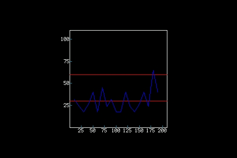

Logging with Dial Gauge Library
---------------------------------------

This example shows how to add limits to our plot

.. literalinclude:: ../examples/logging_with_dial_gauge.py
    :caption: examples/logging_with_dial_gauge.py
    :lines: 5-
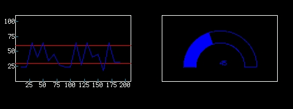

====================
SVG Examples
====================

SVG Images examples
---------------------------

SVG Images example

.. literalinclude:: ../examples/svg_example.py
    :caption: examples/svg_example.py
    :lines: 5-
.. image:: ../docs/svg.jpg

====================
Shade Examples
====================

Shade examples
---------------------------

Shade example

.. literalinclude:: ../examples/shade_example.py
    :caption: examples/shade_example.py
    :lines: 5-
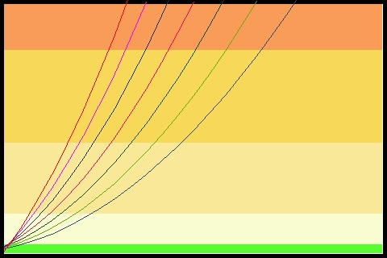

====================
Polar Plot Examples
====================

Polar example
---------------------------

Show how to use the Polar Plot

.. literalinclude:: ../examples/polar_example.py
    :caption: examples/polar_example.py
    :lines: 5-
.. image:: ../docs/polar_example.jpg

Polar Advanced Example
---------------------------

Polar Advanced example

.. literalinclude:: ../examples/polar_advanced.py
    :caption: examples/polar_advanced.py
    :lines: 5-
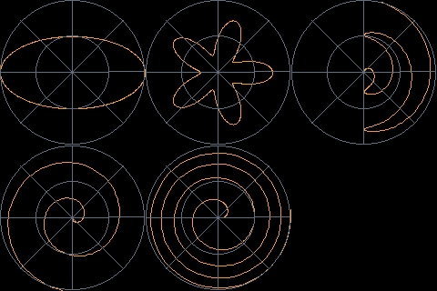

==================
Others
==================
Sparkline Animation Example
---------------------------

Sparkline animation example

.. literalinclude:: ../examples/sparkline.py
    :caption: examples/sparkline.py
    :lines: 5-

Display_shapes Example
-----------------------

Display Shapes integration example

.. literalinclude:: ../examples/display_shapes.py
    :caption: examples/display_shapes.py
    :lines: 5-
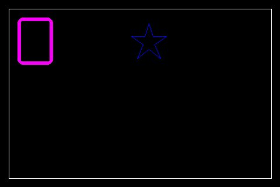

Advanced Example
---------------------------

plot different ulements in a single display

.. literalinclude:: ../examples/readme_example.py
    :caption: examples/readme_example.py
    :lines: 5-
.. image:: ../docs/readme.png

Uboxplot Example
---------------------------

example of uboxplot integration in a plot

.. literalinclude:: ../examples/uboxplot_example.py
    :caption: examples/uboxplot_example.py
    :lines: 8-
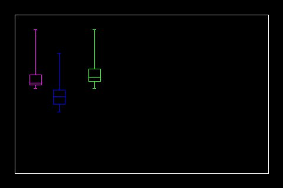
