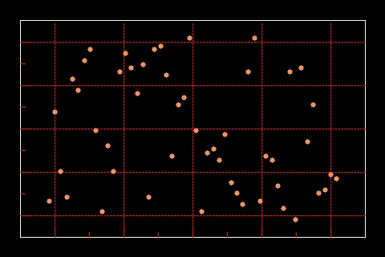
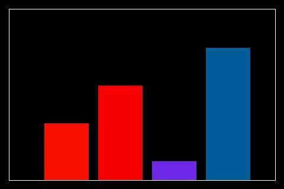
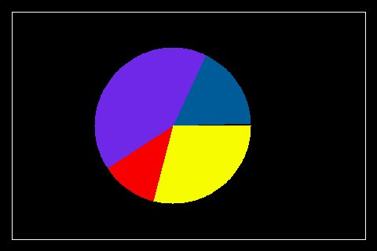
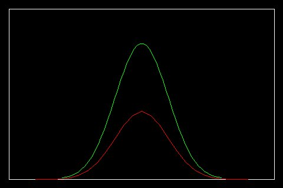
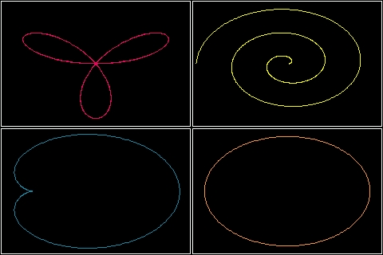
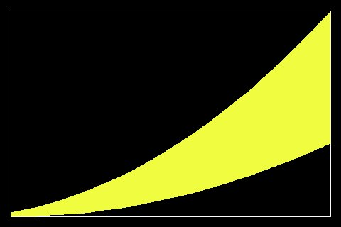
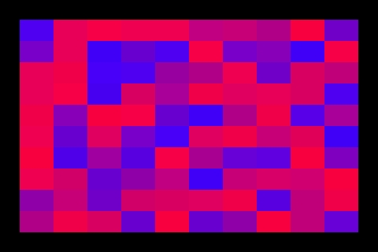
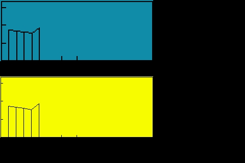
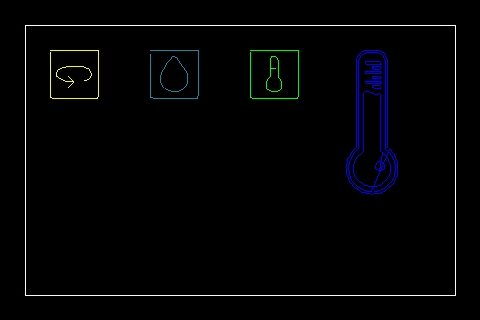
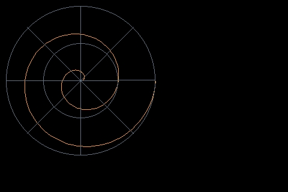

Simple test
------------

Ensure your device works with this simple test.

.. literalinclude:: ../examples/uplot_simpletest.py
    :caption: examples/uplot_simpletest.py
    :lines: 5-

.. image:: ../docs/uplot_ex1.jpg

Plot Example
-------------

Plot some data for x and y

.. literalinclude:: ../examples/uplot_plot_example.py
    :caption: examples/uplot_plot_example.py
    :lines: 5-

.. image:: ../docs/uplot_ex4.jpg

Tick Parameters Settings Example
----------------------------------

Setting up the ticks parameters

.. literalinclude:: ../examples/uplot_tickparameters.py
    :caption: examples/uplot_tickparameters.py
    :lines: 5-

.. image:: ../docs/uplot_ex3.jpg

Integration Example
-------------------

Example showing different graphics elements integration

.. literalinclude:: ../examples/uplot_integration_example.py
    :caption: examples/uplot_integration_example.py
    :lines: 5-
.. image:: ../docs/uplot_ex5.jpg

Scatter Example
-------------------

Scatter plot Example

.. literalinclude:: ../examples/uplot_scatter.py
    :caption: examples/uplot_scatter.py
    :lines: 5-

Display_shapes Example
-----------------------

Display Shapes integration example

.. literalinclude:: ../examples/uplot_display_shapes.py
    :caption: examples/uplot_display_shapes.py
    :lines: 5-
.. image:: ../docs/uplot_ex6.jpg

Bar Example
----------------

Bar example

.. literalinclude:: ../examples/uplot_bar_example.py
    :caption: examples/uplot_bar_example.py
    :lines: 5-

Bar Scale Example
---------------------

Bar plot example showing how to use the scale

.. literalinclude:: ../examples/uplot_bar_scale_example.py
    :caption: examples/uplot_bar_scale_example.py
    :lines: 5-
.. image:: ../docs/bar_scale.jpg

Bar Color Palette Example
----------------------------

Bar plot example showing how to pass a user color Palette

.. literalinclude:: ../examples/uplot_bar_colorpalette.py
    :caption: examples/uplot_bar_colorpalette.py
    :lines: 5-
.. image:: ../docs/bar_palette.jpg

Bar plot updating values Example
---------------------------------

Bar Plot example showing how to update values for a filled bars bar plot

.. literalinclude:: ../examples/uplot_bar_updating_values.py
    :caption: examples/uplot_bar_updating_values.py
    :lines: 5-

Bar plot updating bar colors Example
-------------------------------------

Bar Plot example showing how to update colors for a filled bars bar plot

.. literalinclude:: ../examples/uplot_bar_color_changing.py
    :caption: examples/uplot_bar_color_changing.py
    :lines: 5-

Bar 3D Example
----------------

Bar 3D example

.. literalinclude:: ../examples/uplot_bar_3Dbars.py
    :caption: examples/uplot_bar_3Dbars.py
    :lines: 5-
.. image:: ../docs/uplot_3DBars.jpg

Pie Example
----------------

Pie example

.. literalinclude:: ../examples/uplot_pie_example.py
    :caption: examples/uplot_pie_example.py
    :lines: 5-

Cartesian Advanced Example
---------------------------

Showing the ability to display to graphs in the same plot with different colors

.. literalinclude:: ../examples/uplot_cartesian_advanced.py
    :caption: examples/uplot_cartesian_advanced.py
    :lines: 5-

Cartesian Table Example
---------------------------

Example showing how to add a data table to the plot

.. literalinclude:: ../examples/uplot_cartesian_table.py
    :caption: examples/uplot_cartesian_table.py
    :lines: 5-

Lissajous Curves Example
---------------------------

Example showing how to draw lissajous curves

.. literalinclude:: ../examples/uplot_lissajous_curves.py
    :caption: examples/uplot_lissajous_curves.py
    :lines: 5-
.. image:: ../docs/uplot_lissajous.jpg

Cartesian Polar Plots Example
--------------------------------

Example showing how to draw polar plots using Cartesian

.. literalinclude:: ../examples/uplot_polar_plots.py
    :caption: examples/uplot_polar_plots.py
    :lines: 5-

Stackplot Example
---------------------------

Stackplot simple example

.. literalinclude:: ../examples/uplot_stackplot.py
    :caption: examples/uplot_stackplot.py
    :lines: 8-
.. image:: ../docs/uplot_ex12.jpg

Advanced Example
---------------------------

plot different ulements in a single display

.. literalinclude:: ../examples/uplot_readme_example.py
    :caption: examples/uplot_readme_example.py
    :lines: 5-
.. image:: ../docs/readme.png

Fillbetween Example
---------------------------

Example of fillbetween plot

.. literalinclude:: ../examples/uplot_fillbetween.py
    :caption: examples/uplot_fillbetween.py
    :lines: 5-

Uboxplot Example
---------------------------

example of uboxplot integration with uplot

.. literalinclude:: ../examples/uplot_uboxplot.py
    :caption: examples/uplot_uboxplot.py
    :lines: 8-
.. image:: ../docs/uplot_ex16.jpg

Map Example
---------------------------

map simple example

.. literalinclude:: ../examples/uplot_map.py
    :caption: examples/uplot_map.py
    :lines: 5-

Sparkline Animation Example
---------------------------

Sparkline animation example

.. literalinclude:: ../examples/uplot_sparkline.py
    :caption: examples/uplot_sparkline.py
    :lines: 5-

Cartesian Animation Example
---------------------------

Cartesian animation example

.. literalinclude:: ../examples/uplot_cartesian_loggin_data.py
    :caption: examples/uplot_cartesian_loggin_data.py
    :lines: 5-
.. image:: ../docs/uplot_cartesian.gif

Logging Example
---------------------------

Logging example

.. literalinclude:: ../examples/uplot_logging.py
    :caption: examples/uplot_logging.py
    :lines: 5-

Logging Fill Example
---------------------------

Logging fill example

.. literalinclude:: ../examples/uplot_logging_fill.py
    :caption: examples/uplot_logging_fill.py
    :lines: 5-

Logging Changing Values Example
---------------------------------------

This example shows how to redraw new_values in the same plot

.. literalinclude:: ../examples/uplot_logging_changing_values.py
    :caption: examples/uplot_logging_changing_values.py
    :lines: 5-

Logging with Table Example
---------------------------------------

This example shows how to add a data table to the plot

.. literalinclude:: ../examples/uplot_logging_table.py
    :caption: examples/uplot_logging_table.py
    :lines: 10-
.. image:: ../docs/logging_table.jpg

Logging Animation Example
---------------------------------------

This example shows how to animate a plot

.. literalinclude:: ../examples/uplot_logging_animation.py
    :caption: examples/uplot_logging_animation.py
    :lines: 5-

SVG Images examples
---------------------------

SVG Images example

.. literalinclude:: ../examples/uplot_svg_example.py
    :caption: examples/uplot_svg_example.py
    :lines: 5-

Shade examples
---------------------------

Shade example

.. literalinclude:: ../examples/uplot_shade_example.py
    :caption: examples/uplot_shade_example.py
    :lines: 5-
.. image:: ../docs/uplot_shade.jpg

Polar example
---------------------------

Show how to use the Polar Plot

.. literalinclude:: ../examples/uplot_polar_example.py
    :caption: examples/uplot_polar_example.py
    :lines: 5-

