Simple test
------------

Ensure your device works with this simple test.

.. literalinclude:: ../examples/uplot_simpletest.py
    :caption: examples/uplot_simpletest.py
    :lines: 5-

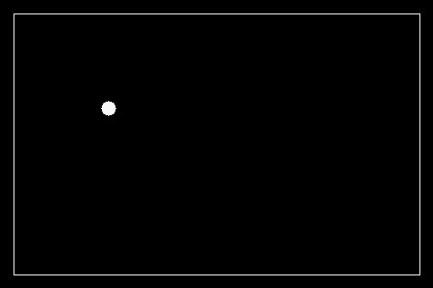

Plot Example
-------------

Plot some data for x and y

.. literalinclude:: ../examples/uplot_plot_example.py
    :caption: examples/uplot_plot_example.py
    :lines: 5-

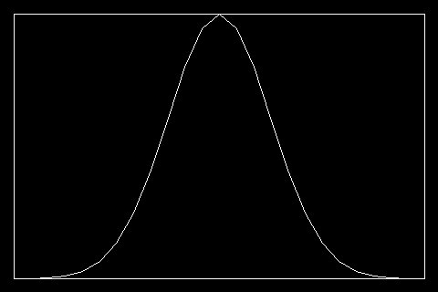

Tick Parameters Settings Example
----------------------------------

Setting up the ticks parameters

.. literalinclude:: ../examples/uplot_tickparameters.py
    :caption: examples/uplot_tickparameters.py
    :lines: 5-

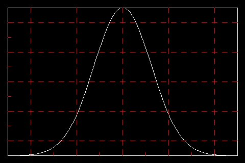

Integration Example
-------------------

Example showing different graphics elements integration

.. literalinclude:: ../examples/uplot_integration_example.py
    :caption: examples/uplot_integration_example.py
    :lines: 5-
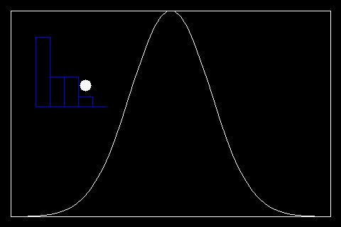

Scatter Example
-------------------

Scatter plot Example

.. literalinclude:: ../examples/uplot_uscatter.py
    :caption: examples/uplot_uscatter.py
    :lines: 5-
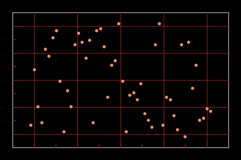

Display_shapes Example
-----------------------

Display Shapes integration example

.. literalinclude:: ../examples/uplot_display_shapes.py
    :caption: examples/uplot_display_shapes.py
    :lines: 5-
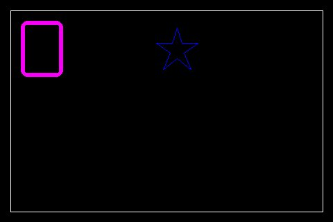

Ubar Example
----------------

ubar example

.. literalinclude:: ../examples/uplot_ubar_example.py
    :caption: examples/uplot_ubar_example.py
    :lines: 5-
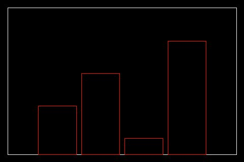

Ubar Scale Example
---------------------

Bar plot example showing how to use the scale

.. literalinclude:: ../examples/uplot_ubar_scale_example.py
    :caption: examples/uplot_ubar_scale_example.py
    :lines: 5-
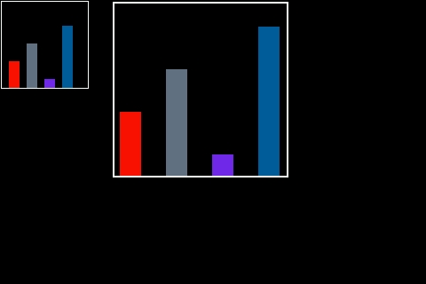

Ubar Color Palette Example
----------------------------

Bar plot example showing how to pass a user color Palette

.. literalinclude:: ../examples/uplot_ubar_colorpalette.py
    :caption: examples/uplot_ubar_colorpalette.py
    :lines: 5-
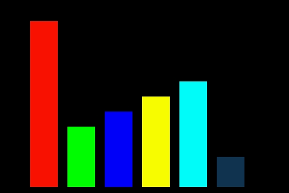

Bar plot updating values Example
---------------------------------

Bar Plot example showing how to update values for a filled bars bar plot

.. literalinclude:: ../examples/uplot_ubar_updating_values.py
    :caption: examples/uplot_ubar_updating_values.py
    :lines: 5-

Bar plot updating bar colors Example
-------------------------------------

Bar Plot example showing how to update colors for a filled bars bar plot

.. literalinclude:: ../examples/uplot_ubar_color_changing.py
    :caption: examples/uplot_ubar_color_changing.py
    :lines: 5-

Ubar 3D Example
----------------

ubar 3D example

.. literalinclude:: ../examples/uplot_ubar_3Dbars.py
    :caption: examples/uplot_ubar_3Dbars.py
    :lines: 5-
.. image:: ../docs/uplot_3DBars.jpg

Upie Example
----------------

upie example

.. literalinclude:: ../examples/uplot_upie_example.py
    :caption: examples/uplot_upie_example.py
    :lines: 5-
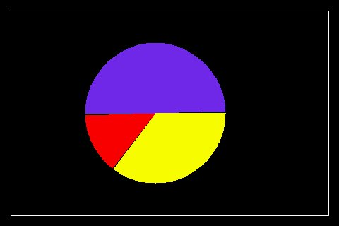

Cartesian Advanced Example
---------------------------

Showing the ability to display to graphs in the same plot with different colors

.. literalinclude:: ../examples/uplot_ucartesian_advanced.py
    :caption: examples/uplot_ucartesian_advanced.py
    :lines: 5-
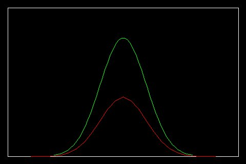

Cartesian Table Example
---------------------------

Example showing how to add a data table to the plot

.. literalinclude:: ../examples/uplot_ucartesian_table.py
    :caption: examples/uplot_ucartesian_table.py
    :lines: 5-

Lissajous Curves Example
---------------------------

Example showing how to draw lissajous curves

.. literalinclude:: ../examples/uplot_lissajous_curves.py
    :caption: examples/uplot_lissajous_curves.py
    :lines: 5-
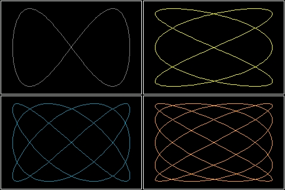

Stackplot Example
---------------------------

Stackplot simple example

.. literalinclude:: ../examples/uplot_stackplot.py
    :caption: examples/uplot_stackplot.py
    :lines: 8-
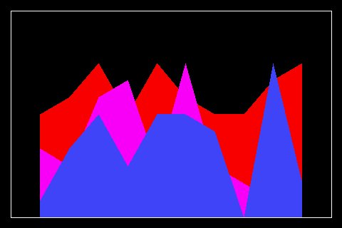

Advanced Example
---------------------------

plot different ulements in a single display

.. literalinclude:: ../examples/uplot_readme_example.py
    :caption: examples/uplot_readme_example.py
    :lines: 5-
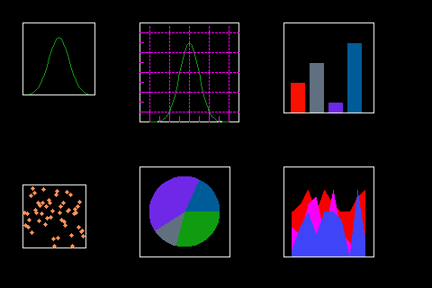

Ufillbetween Example
---------------------------

example of ufillbetween plot

.. literalinclude:: ../examples/uplot_ufillbetween.py
    :caption: examples/uplot_ufillbetween.py
    :lines: 5-
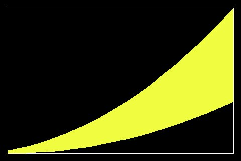

Uboxplot Example
---------------------------

example of uboxplot integration with uplot

.. literalinclude:: ../examples/uplot_uboxplot.py
    :caption: examples/uplot_uboxplot.py
    :lines: 8-
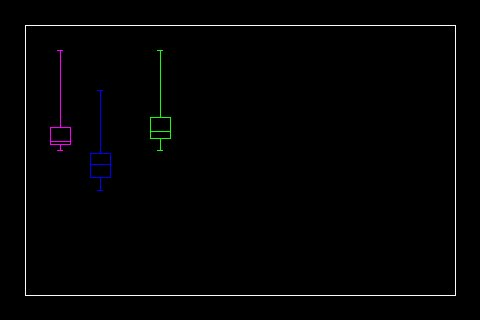

Umap Example
---------------------------

umap simple example

.. literalinclude:: ../examples/uplot_umap.py
    :caption: examples/uplot_umap.py
    :lines: 5-
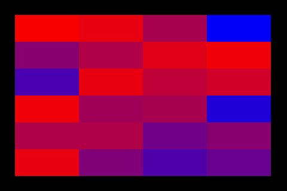

Sparkline Animation Example
---------------------------

Sparkline animation example

.. literalinclude:: ../examples/uplot_sparkline.py
    :caption: examples/uplot_sparkline.py
    :lines: 5-

Cartesian Animation Example
---------------------------

Cartesian animation example

.. literalinclude:: ../examples/uplot_ucartesian_loggin_data.py
    :caption: examples/uplot_ucartesian_loggin_data.py
    :lines: 5-
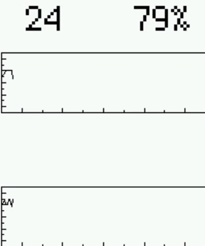

Logging Example
---------------------------

Logging example

.. literalinclude:: ../examples/uplot_ulogging.py
    :caption: examples/uplot_ulogging.py
    :lines: 5-

Logging Fill Example
---------------------------

Logging fill example

.. literalinclude:: ../examples/uplot_logging_fill.py
    :caption: examples/uplot_logging_fill.py
    :lines: 5-
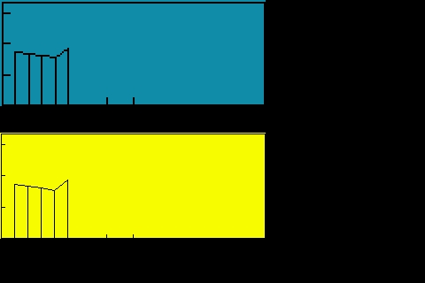

Logging Changing Values Example
---------------------------------------

This example shows how to redraw new_values in the same plot

.. literalinclude:: ../examples/uplot_logging_changing_values.py
    :caption: examples/uplot_logging_changing_values.py
    :lines: 5-

Logging with Table Example
---------------------------------------

This example shows how to add a data table to the plot

.. literalinclude:: ../examples/uplot_logging_table.py
    :caption: examples/uplot_logging_table.py
    :lines: 10-
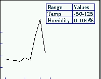

Logging Animation Example
---------------------------------------

This example shows how to animate a plot

.. literalinclude:: ../examples/uplot_ulogging_animation.py
    :caption: examples/uplot_ulogging_animation.py
    :lines: 5-

SVG Images examples
---------------------------

SVG Images example

.. literalinclude:: ../examples/uplot_usvg_example.py
    :caption: examples/uplot_usvg_example.py
    :lines: 5-
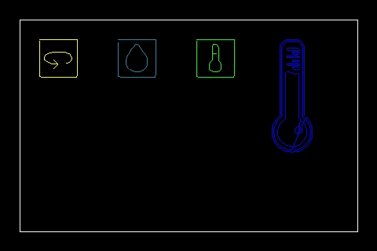

Shade examples
---------------------------

Shade example

.. literalinclude:: ../examples/uplot_shade_example.py
    :caption: examples/uplot_shade_example.py
    :lines: 5-
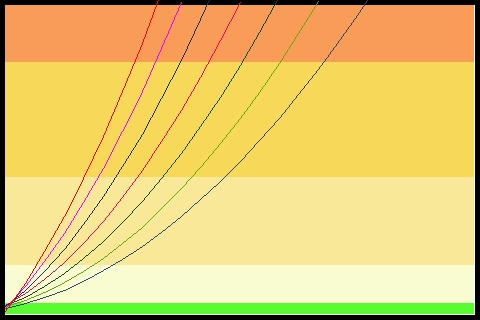
