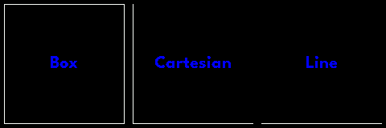
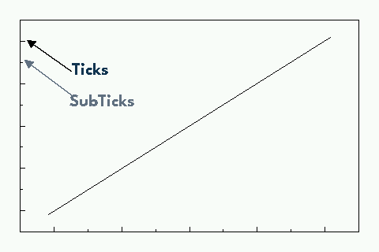
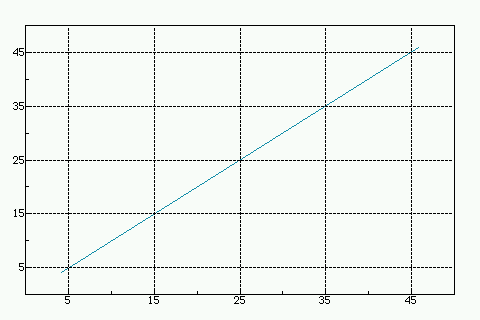
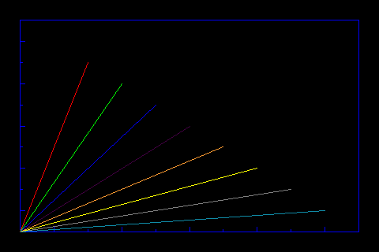

A small tour explaining microplot.

Plot Usage
=============
We start by importing some fundamental libraries for the plot library to operate

.. code-block:: python

    import board
    from circuitpython_uplot.plot import Plot

For reference, screens in CircuitPython are defined from left to right and top to bottom. This means
that our (x=0, y=0) coordinates would be in the left upper corner of the screen.
For boards or feathers with an integrated screen the following statement will initiate the screen

.. code-block:: python

    display = board.DISPLAY

For other displays please consult their support library

After this, we are ready to add the plot area. The following code will create a plot area that will cover the whole screen.
However you can select any area of the screen.

.. code-block:: python

    plot = Plot(0, 0, display.width, display.height)

The plot object will be used to display our graphics. The position and the size of the plot area
could vary. This allows us to have more than 1 plot at the same time in the screen.
Each one of them can have different characteristics or graphs according to your needs.

Options available to customize the plot area are:
    * width: width of the plot area
    * height: height of the plot area
    * background_color: allows you to change the background color. The default is black.
    * box_color: allows you to change the box color. This default is white.
    * padding: allows the user to give the plot area a pad. This is helpful if you are planning to include text and legends in the axes.
    * scale: scale of the plot. This will allow a plot to be scaled up at a user defined rate. This is only available for logging and bar plots.

We then tell the microcontroller to display our plot:

.. code-block:: python

    display.show(plot)

And this is how to build a plot area to add amazing graphs!

.. image:: ../docs/readme.png

Good Luck!

Graphics
===========

The following objects can be added to the plot area:

* Elements in the library
    * Cartesian Plane
    * Fillbetween graph
    * Stackplot
    * Bar graph
    * Pie Chart
    * Colormap
    * Polar graph
    * SVG (Rudimentary support)
    * Logging graph
* Display_shapes library objects
* Histograms from the uhistogram library
* Boxplots from the uboxplot library
* Individual Vectorio Objects

It is possible to add directly to the plot area using the plot bitmap object as shown below

The following code shows an example adding a shape from the Adafruit_Display_shapes
library

.. code-block:: python

    import board
    from adafruit_display_shapes.polygon import Polygon
    from adafruit_display_shapes.roundrect import RoundRect
    from circuitpython_uplot.uplot import Plot

    display = board.DISPLAY
    plot = Plot(0, 0, display.width, display.height)
    roundrect = RoundRect(30, 30, 61, 81, 10, fill=0x0, outline=0xFF00FF, stroke=6)
    plot.append(roundrect)
    display.show(plot)

Ticks and Grid
===============
Plot axes are shown by default. To change this behaviour you would need
to use the correct keyword in the `Plot.axs_params` function:

.. py:function:: Plot.axs_params(axstype = "box")

   :param axstype: Option to display the axes. Defaults to "box"

Options available are:
    * box : draws a box
    * cartesian: draws the left and bottom axes
    * line: draws the bottom axis

The following snippet shows how to create a cartesian plot

.. code-block:: python

    plot = Plot(0, 0, display.width, display.height)
    plot.axs_params(axstype="cartesian")

Tick spacing and numbers are selected and calculated by default. In Cartesian and Logging Plots you can select the ticks to
show in the plot. For other plots, it is possible to customize the following parameters:

.. py:function:: Plot.tick_params(showtick, tickx_height, ticky_height, tickcolor, tickgrid, showtext, decimal_points)

   :param bool showtick: displays the tick. Defaults to `True`
   :param int tickx_height: tickx_height in pixels
   :param int ticky_height: ticky_height in pixels
   :param int tickcolor: tickcolor in Hex format
   :param bool tickgrid: displays the tickgrid. Defaults to `False`
   :param bool showtext: displays the tick text. Defaults to `False`
   :param int decimal_points: number of decimal points to show. Defaults to :const:`0`

.. code-block:: python

    plot.tick_params(tickx_height=6, ticky_height=6, tickcolor=0x000000)

Be aware that ticks are not shown by default. If you want to show them you need to add a graph to the plot.

Gridlines are normally ``OFF``. If you want visible gridlines then use:

.. code-block:: python

    plot.tick_params(tickgrid=True)

If you want to show the axes text, you can use:

.. code-block:: python

    plot.tick_params(showtext=True)

If you want to show some decimal places in the text use:

.. code-block:: python

    plot.tick_params(decimal_points=2)

Colors
===============
You can choose some colors directly from the library. This can be done by importing the color class:

.. code-block:: python

    from circuitpython_uplot.plot import color

This will allow you to use the colors in the list as color variable definitions
    * WHITE
    * BLACK
    * RED
    * GREEN
    * BLUE
    * PURPLE
    * YELLOW
    * ORANGE
    * TEAL
    * GRAY
    * PINK
    * LIGHT_GRAY
    * BROWN
    * DARK_GREEN
    * TURQUOISE
    * DARK_BLUE
    * DARK_RED

.. code-block:: python

    plot = Plot(0, 0, display.width, display.height, background_color=color.WHITE, box_color=color.BLACK)

===========
Cartesian
===========
With the cartesian class is possible to add (x,y) plots. You add it to the plot area created as explained
above. Then you will need to give some ``x`` and ``y`` data. The following code

.. code-block:: python

    from ulab import numpy as np
    from circuitpython_uplot.plot import Plot
    from circuitpython_uplot.cartesian import Cartesian

    display = board.DISPLAY
    plot = Plot(0, 0, display.width, display.height)

    x = [0, 1, 2, 3]
    y = [0, 2, 4, 6]

After the initial setup we add our xy plane and show our plot

.. code-block:: python

    Cartesian(plot, x, y)
    display.show(plot)

You can add more than one graph to the same plot. Howver, you need to define the range of the graph as the two
graphs will share the same axes.

There are some parameters that you can customize:
    * rangex and rangey: you could specify the ranges of your graph. Allowing you to move your graph according to your needs. This parameters only accept lists. This is needed for plotting more than one curve in the plot area.
    * line color: you could specify the color in HEX. Or you could use the color class as explained above.
    * line style: you could specify the line style. The default is a solid line. see below for more details
    * fill: if you selected this as `True` the area under your graph will be filled
    * nudge: this parameter allows yuo to move a little bit the graph. This is useful when the data start/end in the limits of your range

With the following code, we are setting up the x axis to [-5, 5]
the y axis to [0, 1], line color to Green :const:`0x00FF00` and no filling

.. code-block:: python

    x = np.linspace(-3, 3, num=50)
    constant = 2.0 / np.sqrt(2 * np.pi)
    y = constant * np.exp((-(x**2)) / 2.0)
    Cartesian(plot, x, y, rangex=[-5, 5], rangey=[0, 1], line_color=0x00FF00)

if you want to add more than un line to your plot, you could do something like this:

.. code-block:: python

    plot = Plot(0, 0, display.width, display.height)
    x = np.linspace(-4, 4, num=25)
    y1 = x**2 / 2
    y2 = 2 + x**2 + 3 * x
    Cartesian(plot, x, y1, rangex=[-5, 5], rangey=[0, 1])
    Cartesian(plot, x, y2, rangex=[-5, 5], rangey=[0, 1])
    display.show(plot)

if you need to override the ticks automatic rendering, you can use the following code:

.. code-block:: python

    plot = Plot(0, 0, display.width, display.height)
    x = np.linspace(-4, 4, num=25)
    y1 = x**2 / 2
    Cartesian(plot, x, y1, ticksx=[-4, -2, 0, 2, 4], ticksy=[0, 5, 10, 15, 20])

    display.show(plot)

If you are adding more than one curve to the plot ticks will be defined for all curves.
And needs to be defined in the first cartesian graph added to the plot.

Line styles
============
You can select the line style of your Cartesian graph. The following line styles are available:
    * SOLID
    * DOTTED
    * DASHED
    * DASH_DOT

This can be done by importing the color class, from the cartesian library:

.. code-block:: python

    from circuitpython_uplot.cartesian import LineStyle

You can select a dotted line by using the following code: ``line_style=LineStyle.DOTTED``.

.. code-block:: python

    Cartesian(plot, x, y, line_style=LineStyle.DOTTED)

===============
Pie Chart
===============

You can easily create Pie charts with plot. Pie Charts are limited to 6 elements as per the automatic coloring.
To make the Pie Chart the data needs to be in a python list form. The library will take care of the rest

.. code-block:: python

    import board
    from circuitpython_uplot.uplot import Plot
    from circuitpython_uplot.pie import Pie

    display = board.DISPLAY
    plot = Plot(0, 0, display.width, display.height)
    a = [5, 2, 7, 3]
    Pie(plot, a)
    display.show(plot)

There are no other special parameters to customize

===============
Scatter
===============
Creates a scatter plot with x,y data. You can customize the circle diameter if you give the radius as a list of values for (x,y) data

.. code-block:: python

    from random import choice
    import board
    from ulab import numpy as np
    from circuitpython_uplot.uplot import Plot
    from circuitpython_uplot.scatter import Scatter

    display = board.DISPLAY
    plot = Plot(0, 0, display.width, display.height)

    a = np.linspace(1, 100)
    b = [choice(a) for _ in a]
    Scatter(plot, a, b)

There are some parameters that you can customize:
    * rangex and rangey: you can specify the ranges of your graph. This allows you to move your graph according to your needs. This parameters only accept lists
    * radius: circles radius/radii. If a different value is given for each point, the radius should be a list of values. If selected pointer is not a circle, this parameter will be ignored
    * pointer_color: you can specify the color in HEX. Or you could use the color class as explained above.
    * pointer: you can select the pointer shape. The default is a circle. See below for more details
    * nudge: this parameter allows you to move the graph slighty. This is useful when the data start/end in the limits of your range

.. code-block:: python

    a = np.linspace(1, 200, 150)
    z = [4, 5, 6, 7, 8]
    radi = [choice(z) for _ in a]
    b = [choice(a) for _ in a]
    Scatter(plot, a, b, rangex=[0,210], rangey=[0, 210], radius=radi, pointer_color=0xF456F3)

Pointer styles
==============
You can select the pointer style of your Scatter graph. The following pointer styles are available:
    * CIRCLE
    * SQUARE
    * TRIANGLE
    * DIAMOND

This can be done by importing the color class, from the cartesian library:

.. code-block:: python

    from circuitpython_uplot.scatter import Pointer

You can select a square pointer using the following code: ``pointer=Pointer.SQUARE``.

.. code-block:: python

    Scatter(plot, a, b, pointer=Pointer.SQUARE)

===============
Bar Plot
===============

Allows you to graph bar plots. You just need to give the values of the bar in a python list.
You can choose to create shell or filled bars or 3D projected bars.

.. code-block:: python

    import board
    from circuitpython_uplot.uplot import Plot
    from circuitpython_uplot.bar import Bar

    display = board.DISPLAY
    plot = Plot(0, 0, display.width, display.height)

    a = ["a", "b", "c", "d"]
    b = [3, 5, 1, 7]
    Bar(plot, a, b)

You can select the color or/and if the bars are filled

.. code-block:: python

    Bar(plot, a, b, color=0xFF1000, fill=True)

You can also select the bar spacing and the xstart position:

.. code-block:: python

    Bar(plot, a, b, color=0xFF1000, fill=True, bar_space=30, xstart=70)

For bar filled graphs you can pass a color_palette list. This will allow you to select the color of each bar
This will not work for shell bars.

.. code-block:: python

    import board
    from circuitpython_uplot.uplot import Plot
    from circuitpython_uplot.bar import Bar

    display = board.DISPLAY
    plot = Plot(0, 0, display.width, display.height)
    Bar(plot, a, b, fill=True, bar_space=30, xstart=70, color_palette=[0xFF1000, 0x00FF00, 0x0000FF, 0x00FFFF])

With the projection argument you can show the bars with projection. This will give them a 3D
appearance

.. code-block:: python

    import board
    from circuitpython_uplot.uplot import Plot
    from circuitpython_uplot.bar import bar

    display = board.DISPLAY
    plot = Plot(0, 0, display.width, display.height)

    a = ["a", "b", "c", "d"]
    b = [3, 5, 1, 7]
    Bar(plot, a, b, color=0xFF1000, fill=True, bar_space=30, xstart=70, projection=True)

For filled unprojected bars you can update their values in real time. This is useful for data logging.
The max_value argument will allow you to set the maximum value of the graph. The plot will scale
according to this max value, and bar plot will update their values accordingly

.. code-block:: python

    import board
    from circuitpython_uplot.uplot import Plot
    from circuitpython_uplot.bar import Bar

    display = board.DISPLAY
    plot = Plot(0, 0, display.width, display.height)

    a = ["a", "b", "c", "d"]
    b = [3, 5, 1, 7]
    my_bar = Bar(plot, a, b, color=0xFF1000, fill=True, color_palette=[0xFF1000, 0x00FF00, 0xFFFF00, 0x123456], max_value=10)

Then you can update the values of the bar plot in a loop:

.. code-block:: python

    my_bar.update_values([1, 2, 3, 4])

Also for Filled unprojected bars you can change all bars color at once. The following
code will change all the bar's color to red

.. code-block:: python

    my_bar.update_colors(0xFF0000, 0xFF0000, 0xFF0000, 0xFF0000)

If you prefer, you can change the color of a single bar using the code below that will change the first bar to Blue.:

.. code-block:: python

    my_bar.update_bar_color(0, 0x0000FF)

===============
Fillbetween
===============
This is a special case of cartesian graph and has all the attributes of that class. However,
it will fill the area between two curves:

.. code-block:: python

    import board
    from ulab import numpy as np
    from circuitpython_uplot.uplot import Plot
    from circuitpython_uplot.fillbetween import Fillbetween

    display = board.DISPLAY

    plot = Plot(0, 0, display.width, display.height)

    x = np.linspace(0, 8, num=25)

    y1 = x**2 / 2
    y2 = 2 + x**2 + 3 * x

    Fillbetween(plot, x, y1, y2)

    display.show(plot)

===============
Color Map
===============

Allows you to graph color maps. You just need to give the values in a ulab.numpy.array.
You can choose the initial and final colors for the color map.

.. code-block:: python

    import board
    from ulab import numpy as np
    from circuitpython_uplot.plot import Plot
    from circuitpython_uplot.map import Map

    display = board.DISPLAY

    plot = Plot(0, 0, display.width, display.height, show_box=False)

    x = np.array(
        [
            [1, 3, 9, 25],
            [12, 8, 4, 2],
            [18, 3, 7, 5],
            [2, 10, 9, 22],
            [8, 8, 14, 12],
            [3, 13, 17, 15],
        ],
        dtype=np.int16,
    )

    Map(plot, x, 0xFF0000, 0x0000FF)

    display.show(plot)

===============
Logging
===============

This is a similar to Cartesian but designed to allow the user to use it as a data logger.
The user needs to manually set up the range and tick values in order for this graph to work properly

There are some parameters that you can customize:
    * rangex and rangey: you need specify the ranges of your graph. This allows you to move your graph according to your needs. This parameters only accept lists
    * ticksx and ticksy: Specific ticks for the X and Y axes
    * line_color: you can specify the color in HEX
    * tick_pos: Allows to show the ticks below the axes.
    * fill: generates lines under each point, to fill the area under the points

.. code-block:: python

    plot = Plot(0, 0, display.width, display.height)

    x = [10, 20, 30, 40, 50]
    temp_y = [10, 15, 35, 10, 25]

    my_log = Logging(plot, x, y, rangex=[0, 200], rangey=[0, 100], ticksx=[10, 50, 80, 100], ticksy=[15, 30, 45, 60],)

if you want to redraw new data in the same plot, you could do something like this:

.. code-block:: python

    x_new = [10, 20, 30, 40, 50]
    y_new = [26, 50, 26, 50, 26]

    my_log.draw_points(plot_1, x_new, y_new)

===============
SVG
===============

A small module to load, locate and scale svg path collection of points in the plot area. This will tend to be memory consuming as some SVG will have several path points.
There are some pre-provided icons in the ``icons.py`` file, you could add more if needed.
Specific icons are stored as a dictionary in the icons.py file. Every path is a entry in the dictionary.
For example, if you want to load the Temperature icon with a scale of 2

.. code-block:: python

    from circuitpython_uplot.svg import SVG
    from circuitpython_uplot.icons import Temperature

    display = board.DISPLAY
    plot = Plot(0, 0, display.width, display.height)
    SVG(plot, Temperature, 250, 50, 2)
    display.show(plot)

===============
SHADE
===============
Shade is a small module to add a shaded area to the plot. This is useful to highlight a specific area in the plot.
By itself will only fill rectangular areas in the plot area. However, it can be used in conjunction with other modules to create
more complex plots. Refer to the examples for more details.

=====================
Polar Plot
=====================

Allows to plot polar graphs. You just need to give the values of the graph in a python list.
See the examples folder for more information.
